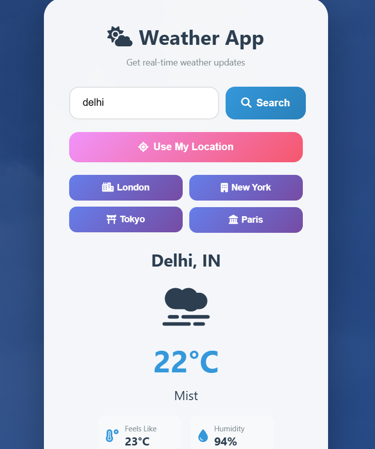

🌤️ Weather App

A simple and interactive Weather Forecasting Web App that displays real-time weather updates for any city using the OpenWeatherMap API.

🚀 Features

🌎 Search weather by city name

🌡️ Displays temperature, humidity, and weather condition

📱 Fully responsive design (works on phone & desktop)

⚡ Built using HTML, CSS, and JavaScript

🔑 Uses OpenWeatherMap API for live weather data

🛠️ Technologies Used

HTML5 – structure

CSS3 – styling

JavaScript (Fetch API) – API integration & DOM updates

OpenWeatherMap API – live weather information

⚙️ Setup Instructions

Clone this repository

git clone https://github.com/Anish-Tiwari2027/Weather-API-App.git

Navigate to the folder

cd Weather-API-App

Open index.html in your browser

Replace the API key in the JS file with your own key from OpenWeatherMap

📸 Preview

Displays temperature, humidity, and weather description for any searched city.

🧠 Future Enhancements

🌈 Add dynamic weather background images

📍 Auto-detect location using Geolocation API

📅 5-day weather forecast

📜 License

This project is licensed under the MIT License – free to use and modify.

👨‍💻 Author

Anish Tiwari
💼 Passionate about AI/ML, Web Development, and Problem Solving